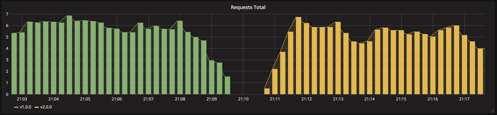

# Recreate deployment

Version 1 is stopped before version 2 starts. The strategy uses no surge capacity, but the Service has no ready endpoints during the replacement.



## Deploy version 1

Run the commands from this directory:

```sh
kubectl apply -f app-v1.yaml
kubectl rollout status deployment/my-app --timeout=300s
```

On EKS, wait for the load-balancer hostname and set the URL:

```sh
kubectl get service my-app -w
APP_URL="http://$(kubectl get service my-app \
  -o jsonpath='{.status.loadBalancer.ingress[0].hostname}')"
curl "$APP_URL"
```

On Kind, keep this port-forward running in another terminal:

```sh
kubectl port-forward service/my-app 8080:80
```

Then set the URL and test it:

```sh
APP_URL=http://localhost:8080
curl "$APP_URL"
```

The response reports `Version: v1.0.0`.

## Replace it with version 2

Optionally keep requests running in another terminal to observe the expected interruption:

```sh
while sleep 0.5; do curl --connect-timeout 1 "$APP_URL"; done
```

Apply version 2:

```sh
kubectl apply -f app-v2.yaml
kubectl rollout status deployment/my-app --timeout=300s
curl "$APP_URL"
```

The response now reports `Version: v2.0.0`.

## Cleanup

```sh
kubectl delete -f app-v2.yaml --ignore-not-found
kubectl delete service my-app --ignore-not-found
```
