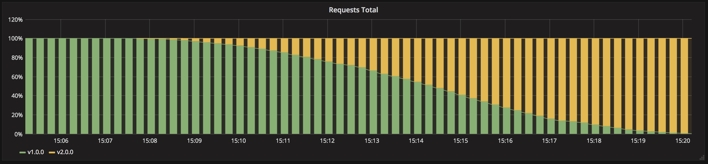

# Ramped deployment

Version 2 gradually replaces version 1 with a rolling update. This example keeps all nine replicas available with `maxUnavailable: 0` and adds at most two surge replicas.



## Deploy version 1

Run the commands from this directory:

```sh
kubectl apply -f app-v1.yaml
kubectl rollout status deployment/my-app --timeout=300s
```

On EKS:

```sh
kubectl get service my-app -w
APP_URL="http://$(kubectl get service my-app \
  -o jsonpath='{.status.loadBalancer.ingress[0].hostname}')"
curl "$APP_URL"
```

On Kind, keep a port-forward running in another terminal:

```sh
kubectl port-forward service/my-app 8080:80
```

Then use:

```sh
APP_URL=http://localhost:8080
curl "$APP_URL"
```

The response reports `Version: v1.0.0`.

## Roll out version 2

Apply the update and pause it after the first surge Pods appear:

```sh
kubectl apply -f app-v2.yaml
kubectl rollout pause deployment/my-app
kubectl get pods -L version
```

Both versions should be visible. Resume and wait for completion:

```sh
kubectl rollout resume deployment/my-app
kubectl rollout status deployment/my-app --timeout=600s
curl "$APP_URL"
```

The response reports `Version: v2.0.0`.

Rollback remains available through the Deployment history:

```sh
kubectl rollout undo deployment/my-app
kubectl rollout status deployment/my-app --timeout=600s
```

## Cleanup

```sh
kubectl delete -f app-v2.yaml --ignore-not-found
kubectl delete service my-app --ignore-not-found
```