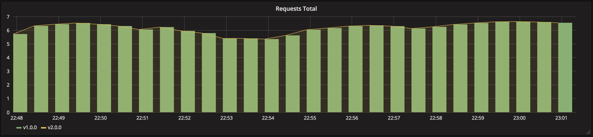

# Shadow deployment using Istio

A shadow deployment mirrors real requests to version 2 while returning only the
version 1 response. Mirrored traffic must not trigger unsafe side effects; use
isolated downstream dependencies when testing state-changing workloads.



## Prerequisites and shared Istio installation

Use an EKS or Kind cluster with `kubectl`, Helm 3, and `curl`. Install Istio
1.30.5 once for the cluster if these shared releases are not already present:

```bash
helm repo add istio https://istio-release.storage.googleapis.com/charts \
  --force-update
helm repo update
helm upgrade --install istio-base istio/base \
  --namespace istio-system --create-namespace --version 1.30.5 --wait
helm upgrade --install istiod istio/istiod \
  --namespace istio-system --version 1.30.5 --wait
helm upgrade --install istio-ingress istio/gateway \
  --namespace istio-ingress --create-namespace --version 1.30.5 \
  --set labels.istio=ingressgateway --wait
kubectl rollout status deployment/istiod -n istio-system --timeout=5m
kubectl rollout status deployment/istio-ingress -n istio-ingress --timeout=5m
```

On EKS, enable cross-zone balancing and route only to nodes with a local gateway endpoint:

```bash
helm upgrade istio-ingress istio/gateway \
  --namespace istio-ingress --version 1.30.5 --reuse-values \
  --set service.externalTrafficPolicy=Local \
  --set-string 'service.annotations.service\.beta\.kubernetes\.io/aws-load-balancer-cross-zone-load-balancing-enabled=true' \
  --wait
```

The control plane and ingress gateway are shared cluster infrastructure. This
scenario uses its own sidecar-injected namespace and cleanup removes only that
namespace.

## Deploy the applications and primary route

Run all remaining commands from this directory:

```bash
kubectl create namespace shadow-istio --dry-run=client -o yaml | kubectl apply -f -
kubectl label namespace shadow-istio istio-injection=enabled --overwrite
kubectl apply -n shadow-istio -f app-v1.yaml -f app-v2.yaml
kubectl rollout status deployment/my-app-v1 -n shadow-istio --timeout=5m
kubectl rollout status deployment/my-app-v2 -n shadow-istio --timeout=5m
kubectl apply -n shadow-istio -f gateway.yaml -f virtualservice.yaml
kubectl get pods -n shadow-istio
```

Each application Pod should show both the application and sidecar containers as
ready.

### Access on EKS

Wait for the gateway hostname, then set the scenario URL:

```bash
kubectl get service istio-ingress -n istio-ingress -w
export ISTIO_URL="http://$(kubectl get service istio-ingress \
  -n istio-ingress \
  -o jsonpath='{.status.loadBalancer.ingress[0].hostname}')"
```

### Access on Kind

Keep this port-forward running in a separate terminal:

```bash
kubectl port-forward service/istio-ingress -n istio-ingress 8080:80
```

In the scenario terminal, set the URL:

```bash
export ISTIO_URL=http://127.0.0.1:8080
```

Confirm that the primary route returns version 1:

```bash
curl -H 'Host: my-app.local' "$ISTIO_URL"
```

## Enable and verify mirroring

Apply the mirror route and send a request sample. Client responses must continue
to report only version 1:

```bash
kubectl apply -n shadow-istio -f virtualservice-mirror.yaml

for i in $(seq 1 10); do
  curl -s -H 'Host: my-app.local' "$ISTIO_URL"
done | grep -o 'Version: v[0-9.]*' | sort | uniq -c
```

Both application logs should contain the requests, proving that version 2
received mirrored copies without supplying the client response:

```bash
kubectl logs deployment/my-app-v1 -n shadow-istio -c my-app --tail=20
kubectl logs deployment/my-app-v2 -n shadow-istio -c my-app --tail=20
```

Disable mirroring by restoring the primary-only route:

```bash
kubectl apply -n shadow-istio -f virtualservice.yaml
```

## Cleanup

```bash
kubectl delete namespace shadow-istio
```
