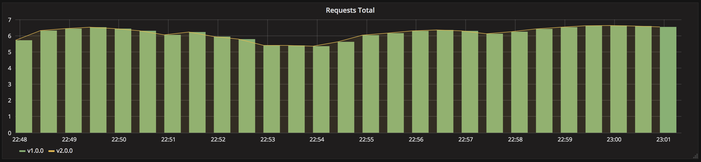

# Kubernetes deployment strategies

This lab is based on https://github.com/ContainerSolutions/k8s-deployment-strategies/tree/master, but using a cloud based Kubernetes Cluster instead of minikube.

> In Kubernetes there are a few different ways to release an application, you have
> to carefully choose the right strategy to make your infrastructure resilient.

- [recreate](recreate/): terminate the old version and release the new one
- [ramped](ramped/): release a new version on a rolling update fashion, one
  after the other
- [blue/green](blue-green/): release a new version alongside the old version
  then switch traffic
- [canary](canary/): release a new version to a subset of users, then proceed
  to a full rollout
- [a/b testing](ab-testing/): release a new version to a subset of users in a
  precise way (HTTP headers, cookie, weight, etc.). This doesn’t come out of the
  box with Kubernetes, it imply extra work to setup a smarter
  loadbalancing system (Istio, Linkerd, Traeffik, custom nginx/haproxy, etc).
- [shadow](shadow/): release a new version alongside the old version. Incoming
  traffic is mirrored to the new version and doesn't impact the
  response.


Before experimenting, checkout the original repository at [ContainerSolutions/k8s-deployment-strategies/](https://github.com/ContainerSolutions/k8s-deployment-strategies/tree/master).

## Getting started

Deploy a cluster using the resources available at the labs.

## Visualizing using Prometheus and Grafana

The following steps describe how to setup Prometheus and Grafana to visualize
the progress and performance of a deployment.

### Install Helm3

To install Helm3, follow the instructions provided on their
[website](https://github.com/kubernetes/helm/releases).

### Install Prometheus (if required)

```
helm repo add prometheus-community https://prometheus-community.github.io/helm-charts
helm install prometheus prometheus-community/prometheus \
    --create-namespace --namespace=monitoring
```

### Install Grafana (if required)

```
helm upgrade -i grafana-operator oci://ghcr.io/grafana-operator/helm-charts/grafana-operator --namespace monitoring --version v5.0.0
```

### Setup Grafana (if required)

Now that Prometheus and Grafana are up and running, you can access Grafana:

```
kubectl apply -f 00-monitoring/grafana.yaml --namespace monitoring
```

Wait for the load balancer to be provisioned:

```
kubectl get svc -n monitoring grafana-service
```

```
echo "http://$(kubectl get svc -n monitoring grafana-service \
    -o jsonpath="{.status.loadBalancer.ingress[*]['ip', 'hostname']}")"
```

To login, username: `admin`, password: `admin`.

### Deploy the Grafana deployment Dashboard

```
kubectl apply -f 00-monitoring/deployments-dashboard.yaml --namespace monitoring
```

#### Example graph

Recreate:


Ramped:


Blue/Green:


Canary:


A/B testing:


Shadow:


