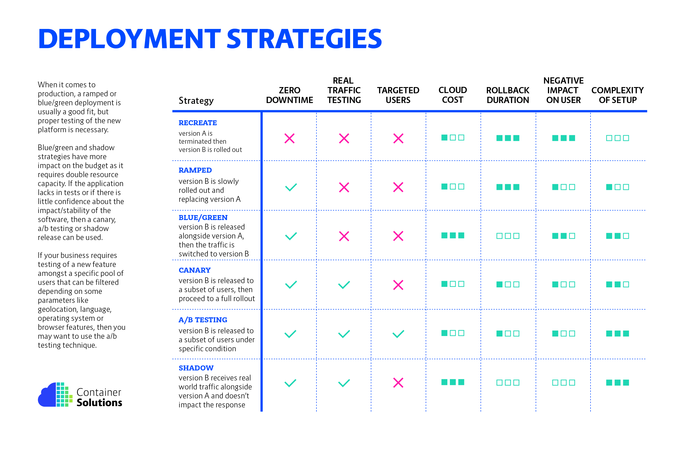

# Kubernetes deployment strategies

Kubernetes supports several release patterns. Choose a strategy based on the
amount of additional capacity, traffic control, and operational risk that the
workload can tolerate.

1. [Recreate](01-recreate/): stop the old version before starting the new one.
2. [Ramped](02-ramped/): replace instances gradually with a rolling update.
3. [Blue/green](03-blue-green/): run both versions, then switch traffic.
4. [Canary](04-canary/): expose a small share of traffic to the new version
   before promotion.
5. [A/B testing](05-ab-testing/): route selected requests by weight or request
   attributes.
6. [Shadow](06-shadow/): mirror requests to the new version without using its
   response.



## Prerequisites and controller scope

Use either an EKS cluster or a Kind cluster with a current `kubectl`, Helm 3,
and `curl`. Confirm the selected context before applying a scenario:

```bash
kubectl config current-context
kubectl get nodes
```

The ingress-nginx and Istio installations used by some scenarios are
cluster-level, shared infrastructure. Install each once when its guide asks for
it. Scenario cleanup removes only scenario workloads or namespaces and leaves
those shared components available for the other labs. The Istio canary HPA also
requires metrics-server in the cluster.

On EKS, the control-plane security group must reach the node security group on TCP `15017` for Istio's sidecar-injection webhook. The AWS Academy Terraform stack in this repository manages that rule through `node_security_group_additional_rules`; add an equivalent rule when using another EKS stack.

## Optional Prometheus and Grafana visualization

Run this single command from this directory:

```bash
./00-monitoring/install.sh
```

The installer ensures that the cluster has a default StorageClass, then
installs or upgrades Prometheus and Grafana Operator, applies the Grafana
instance, datasource, and deployment-strategies dashboard, and waits until
Grafana is available. It is safe to run again against an existing installation.

Prometheus persistence requires a default StorageClass. If the cluster has no
default, the installer marks `gp2` (EKS) or `standard` (Kind) as default. It
stops without changing the cluster when none of those StorageClasses exist.

### Access Grafana on EKS

Wait until the service has a load-balancer hostname, then open the printed URL:

```bash
kubectl get service grafana-service -n monitoring -w
export GRAFANA_HOST="$(kubectl get service grafana-service -n monitoring \
  -o jsonpath='{.status.loadBalancer.ingress[0].hostname}')"
echo "http://${GRAFANA_HOST}"
```

### Access Grafana on Kind

Keep this command running and open <http://127.0.0.1:3000>:

```bash
kubectl port-forward service/grafana-service -n monitoring 3000:80
```

Sign in with username `admin` and password `admin`.

## Example dashboards

- [Recreate](01-recreate/grafana-recreate.png)
- [Ramped](02-ramped/grafana-ramped.png)
- [Blue/green](03-blue-green/grafana-blue-green.png)
- [Canary](04-canary/grafana-canary.png)
- [A/B testing](05-ab-testing/grafana-ab-testing.png)
- [Shadow](06-shadow/grafana-shadow.png)
